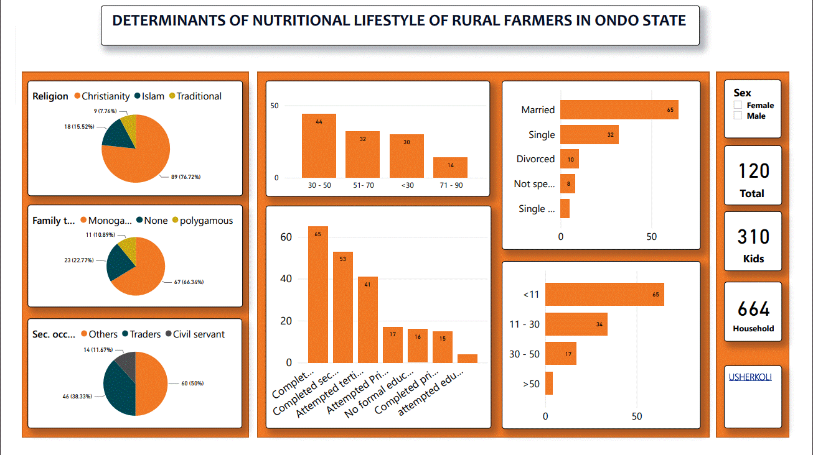

### DETERMINANTS OF NUTRITIONAL LIFESTYLE OF RURAL FARMERS IN ONDO STATE 

Presented are the socio-economic characteristics of the respondents, the  sources of information they relied on for nutrition-related knowledge, their access to these sources,  their nutritional lifestyle, their level of knowledge of nutrition, and the constraints they faced in  maintaining a healthy nutritional lifestyle.
#### Research Questions
 i.	What are the socioeconomic characteristics of the respondents?

ii.	What are the sources of nutrition and the nutrition available?

iii.What are the nutritional lifestyle they partake in?

iv.	How are there level of education and impart of feeding on their nutrition?

v.	What are the possible means to take to correct the nutritional lifestyle? 
#### Research Objective
i.	Ascertain the socioeconomic characteristics of the respondents.

ii.	Identify sources of information on nutrition available to the farmers.

iii.	Determine the nutritional lifestyle of the farmers.

iv.	Determine the knowledge of farmers on nutrition.

v.	Identify constraints to correct nutritional lifestyle.
#### Hypotheses of the study
Ho: There is no significant relationship between selected socio-economic characteristics of rural farmers and their nutritional lifestyle.

Ho: There is no significant relationship between sources of information on nutrition lifestyle and knowledge of the rural farmers.
### Methodology
#### Study Area 

Ondo State, which is indeed a microcosm of the Nigeria nation, is blessed with resourceful, industrious and hospitable people, namely: Akoko, Akure, Apoi, Idanre, Ijaw, Ikale, Ilaje, Ondo and Owo. Its crop of educated elites has led to its being classified as one of the most educationally advanced states in Nigeria. The people are mostly subsistence farmers, fishermen and traders.
#### Population and Sampling Procedure
Population consisted of all rural farmers in the state. A multistage sampling procedure will be used in selecting respondents for the study. In the first stage, three (3) local government areas out of the Eighteen (18) local government areas in the study area will be randomly selected using simple random technique. In the second stage, two (2) communities will be randomly selected each from the three (3) local governments. Then the third stage, will be random selection of twenty (20) rural farmers from each of the communities selected in second stage using simple random sampling techniques. In all a total of One Hundred and Twenty (120) rural farmers constituted the sampling size for this study
#### Method of Data Collection
Primary data will be used for the study. Primary data from the rural farmers will be collected, the aid of an interview schedule. The interview schedule will be divided into sections based on the objectives of the study.
#### Variables & Measurement
Age: will be measured in terms of the respondents’ number of years in age at the time data was collected.

Religion: will be measured in terms of Christianity =1, Islam = 2 and Traditional religion = 3.

Household Size: This refers to the actual number of people in the family and it was measured in numbers.

Number of children: This referred to the actual number of biological children of the respondents.

Years of marriage: This referred to the number of years the respondent has spent in marriage and will be measured in years.

Marriage type: This referred to the type of marriage the respondents belongs to and was measured in term of monogamous, polygamous and others.

Family type: This refers to the type of family settings the respondents is in term of nuclear and extended.

Educational Level: was measured in terms of no Formal Education = 0, attempted Primary School = 1, completed Primary School = 2, attempted Secondary School = 3, completed secondary School = 4, tertiary School = 5.

Secondary occupation: was measured at a nominal level in terms of trader =1, Civil servant =2, and others = 3.

Farm size: this referred to the area used by the respondents in cultivating, this was measured using the actual number in hectare(s).

Annual income: referred to the total amount of income the respondents earn in a period of one year, it was measured in Naira. 

Association/group membership: referred to different association that the respondents belonged to especially in the local community. This was measured using dichotomous question Yes =1 or No=2.

Additional Variables: Not specified in empty cells.

### Data Analysis & Preparation
The primary data collected through a questionaire was inputed into SPSS 16 and all variables were assigned values. The missing values were specified as Zero for variables measured at interval level and Not specified for Ordibal & Nominal variables. 

#### Data Extraction, Loading & Transformation
The raw data was exported to Excel 2016 and saved in xlsx format. The saved data was then loaded to Power bi and i proceeded to transform using power query. The data was then Vizualized using Power Bi.

### Data Vizualization (Power Bi)
![Power Bi vizualization]

### Hypothesis Result (SPSS 16)
Ho1: There is no significant relationship between selected socio-economic characteristics of 
rural farmers and their nutritional lifestyle.

Based on the results of the Pearson correlation, there is no significant relationship between the 
selected socio-economic characteristics of rural farmers and their nutritional lifestyle. The only 
significant correlation was between years of marriage and nutritional lifestyle, with a Pearson 
correlation of 0.192 and a p-value of 0.036. This suggests that the longer a rural farmer has been 
married, the more likely they are to have a better nutritional lifestyle. However, all other 
correlations were not significant, with p-values above 0.05.

 This suggests that age, family type, 
household size, number of children, years of experience in an occupation, years of experience in a 
secondary occupation, farm size, and average annual income do not significantly influence 
nutritional lifestyle. 

Ho2: There is no significant relationship between sources of information on nutrition lifestyle 
and knowledge of the rural farmers.

The results of the chi-square tests indicate that there is no statistically significant relationship 
between sources of information on nutrition lifestyle and knowledge of the rural farmers, with a 
p-value of 0.953. This suggests that sources of information on nutrition lifestyle do not have a 
significant impact on the knowledge of the rural farmers.

### 🛠 TOOLS
SPSS 16

EXCEL 2016

POWER Bi

## Authors

- [@usherkoli](https://www.github.com/usherkoli)
- Dr. Odefadehan
- Adedokun Kudirat 

## 🛠 Skills
Data collection, Data entry, Data cleaming &transformation, Data extract, power quary, Data vizualization, Machine learning, Report writing, Research.

